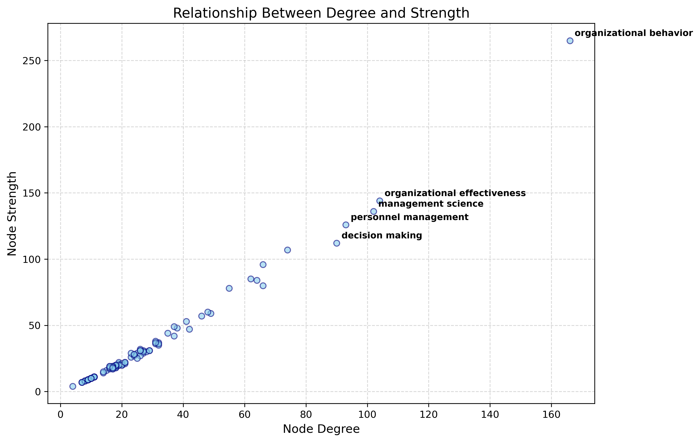

# Project 3: Exploring Keyword Co-occurrence Networks in Scientific Publications
**Course:** IE6400 38245 Foundations Data Analytics Engineering  
**Student:** Le Minh Tuong (ID: 003151597)

## 1. Project Objective
The objective of this project was to analyze scientific publication data by transforming keyword lists into a structured network. By calculating network metrics such as Degree and Strength, I can identify which research topics act as central "hubs" and how different academic concepts relate to one another within the field.

## 2. Methodology
* **Data Preparation:** Keywords from columns 1 to 12 were extracted from `data/keywords_data.csv`. All terms were normalized to lowercase and stripped of leading whitespace.
* **Co-occurrence Logic:** For each article, I paired the unique keywords together.
* **Adjacency Matrix:** I built a symmetric weighted adjacency matrix. In this matrix, a value represents how many times Keyword A and Keyword B appeared in the same paper.
* **Weighted Network:** Using the NetworkX library, the adjacency matrix was converted into an undirected graph to calculate Degree and Strength.

## 3. Results and Interpretation

### Weighted Keyword Co-occurrence Network

  
  
<b>Figure 1:</b> Weighted Keyword Co-occurrence Network

The resulting network contains **248 unique nodes** (keywords) and **2,141 edges** (unique connections).

### Top 10 nodes by degree and Top 10 nodes by strength

<table style="width:100%">
  <tr>
    <th style="text-align:left"> Top 10 by Degree</th>
    <th style="text-align:left"> Top 10 by Strength</th>
  </tr>
  <tr>
<td style="vertical-align:top">

| Rank | Keyword | Degree |
| :--- | :--- | :--- |
| 1 | organizational behavior | 166 |
| 2 | organizational effectiveness | 104 |
| 3 | management science | 102 |
| 4 | personnel management | 93 |
| 5 | decision making | 90 |
| 6 | organizational structure | 74 |
| 7 | organizational sociology | 66 |
| 8 | strategic planning | 66 |
| 9 | industrial management | 64 |
| 10 | corporate governance | 62 |

</td>
<td style="vertical-align:top">

| Rank | Keyword | Strength |
| :--- | :--- | :--- |
| 1 | organizational behavior | 265 |
| 2 | organizational effectiveness | 144 |
| 3 | management science | 136 |
| 4 | personnel management | 126 |
| 5 | decision making | 112 |
| 6 | organizational structure | 107 |
| 7 | organizational sociology | 96 |
| 8 | corporate governance | 85 |
| 9 | industrial management | 84 |
| 10 | strategic planning | 80 |

</td>
  </tr>
</table>

### Top 10 node pairs by weight

| Keyword 1 | Keyword 2 | Weight | Rank |
| :--- | :--- | :--- | :--- |
| Organizational Behavior | Organizational Effectiveness | 11 | 1 |
| Organizational Behavior | Organizational Structure | 9 | 2 |
| Organizational Behavior | Personnel Management | 8 | 3 |
| Management Science | Organizational Behavior | 7 | 4 |
| Organizational Effectiveness | Organizational Structure | 6 | 5 |
| Organizational Behavior | Organizational Sociology | 6 | 6 |
| Decision Making | Organizational Behavior | 6 | 7 |
| Corporate Governance | Organizational Behavior | 6 | 8 |
| Organizational Sociology | Teams in the Workplace | 5 | 9 |
| Industrial Management | Organizational Behavior | 5 | 10 |

### Key Insights

  
  
<b>Figure 2:</b> Relationship between Keyword Degree and Strength (Co-occurrence).

* **The Central Hub:** "Organizational Behavior" is the most critical node in the network. It has a Degree of 166, meaning it connects to over 65% of all other keywords in the study. It also has the highest Strength (265), showing it is the most frequently discussed topic.
* **Strongest Relationships:** The most frequent co-occurrence pair is **"organizational behavior"** and **"organizational effectiveness"** with a weight of 11. This suggests these two fields are the most deeply integrated topics in this literature set.
* **Linear Correlation:** The relationship between Degree and Strength is almost perfectly linear (correlation ≈ 0.99). This indicates that in this dataset, keywords that are connected to a wide variety of other topics are also the ones used most frequently.

## 4. Conclusion
The network analysis successfully identified the core structure of the publication data. The high density of connections around "Organizational Behavior" suggests it serves as a "bridge" topic that links many diverse areas of management and data analytics. Any research path through this specific dataset is statistically likely to relate back to this central hub.